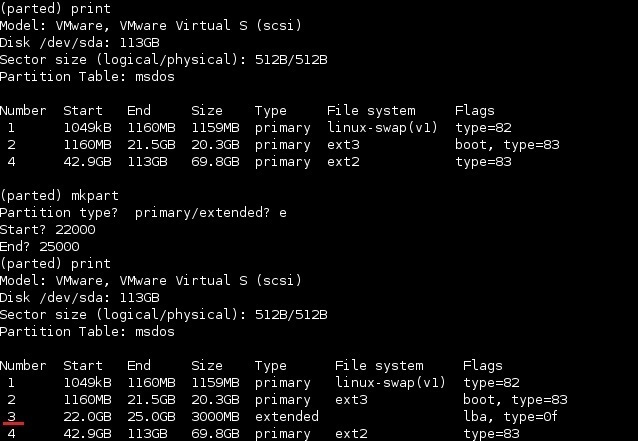

<!-- ../../../assets/images/emacs-org/Jupyter.png  -->
---
Hey there! Are you ready to dive into the world of NixOS? Get ready to experience a unique Linux distribution that's all about declarative configuration and package management. NixOS brings reproducibility, atomic upgrades and rollbacks, and package isolation to the table. Let's walk through the installation process of NixOS and learn how to partition your disk using the `parted` command-line tool.

---

## What is NixOS?

NixOS is an immutable OS.

An immutable system refers to a system where the state or configuration cannot be changed once it is set. In simpler terms, it means that once something is set up or configured in an immutable system, it cannot be modified or altered afterwards. It remains fixed and cannot be changed.

NixOS is not like a conventional distro with a package manager, and does not support the [File Hierarchy Standard](https://access.redhat.com/documentation/en-us/red_hat_enterprise_linux/4/html/reference_guide/s1-filesystem-fhs).

NixOS is an operating system that follows the concept of immutability. It is built on the Nix package manager, which allows for declarative and reproducible system configurations. In NixOS, the entire operating system, including the kernel, packages, and system settings, is defined in a configuration file. This configuration file specifies exactly how the system should be set up and what packages should be installed.

The key idea behind NixOS is that the system configuration is treated as a single, atomic entity. Any changes to the system are made by creating a new configuration file rather than modifying the existing one. This ensures that the system remains consistent and predictable, as any changes are applied in a controlled and reproducible manner.

---

### Notes

- The bootloader is installed to ~/boot/efi~ /boot. I highly recommend not changing this, as it gave me a lot of trouble (I assumed wrongly that the bootloader would be installed to /boot/efi for EFI systems, but this is *not* the case). This was a huge time loss for me, so kindly note this.

- If you're planning on backing up your NixOS config file (which i highly recommend you do), don't back up `hardware-configuration.nix`, this is auto-generated.

- It's advisable to split up the config into separate files (check out my [nixOS dotfiles](https://gitlab.com/zstg/nixos-config/)).

- NixOS recommends a UEFI+systemd-boot setup (because this works well on relatively modern hardware).

- Changing bootloader settings is not as easy as modifying other settings, and this needs a reinstall of the bootloader (`sudo nixos-rebuild switch --install-bootloader`). This is a risky operation, and if done improperly, can render your system completely unbootable.

- While it is entirely possible to move from `systemd-boot` to `grub` (and vice-versa), it is not recommended to switch post-install. Systemd-boot is minimal and offers few customizability options, whereas grub offers tons of customization.

- The root of the filesystem (namely `/`), and `/nix/store`, should be mounted on the same drive. You *must not* mount `/` and `/nix/store` - `/nix/store` is *not meant to be mounted* _at all_. Check [my partitioning layout](#want-a-sample-configuration) for an idea.

---

# Installing NixOS

Before we get started, it's worth mentioning that installing NixOS differs a bit from the usual Linux distribution installation process. Instead of a traditional installer, we'll be working with configuration files to set up our system. Let the installation begin!

##### Create a bootable USB drive: 
Head over to the official NixOS website and grab the latest NixOS ISO. Once you have it, use a tool like `dd` or BalenaEtcher to create a bootable USB drive.

##### Boot into the NixOS live environment:
Plug in the USB drive and boot up your computer from it. You should see the NixOS boot menu. Go ahead and select the default option to boot into the live environment.

##### Partition your disk: 
After entering the live environment, open up a terminal and fire up `parted` by running the command `parted /dev/sda`. Make sure to replace `/dev/sda` with the appropriate device name for your system.

#####  Create partitions: 
It's time to create those partitions! Use `parted` to create the partitions you need. For example, if you want to create a root partition, try running this in your terminal:

   
   `(parted) mkpart primary ext4 1MiB 100GiB`
   

   This command creates a primary partition with the ext4 file system, starting from 1MiB and going up to 100GiB. Customize the size and file system to your liking. Repeat this step for any additional partitions you require, like a swap partition or a separate home partition.

   


##### Set partition flags: 
If you need to set specific flags for certain partitions, like the boot flag for an EFI partition, `parted` has got you covered. Use the `set` command to make it happen. Here's an example:

   
   `(parted) set 1 boot on`
   

   This command sets the boot flag on partition 1.

##### Quit parted: 
After you finish partitioning, it's time to say goodbye to `parted`. Just type `quit` in the `parted` prompt, and you'll be on your way.

##### Format the partitions: 
Let's format those partitions you just created with the appropriate file systems. To format the root partition as ext4, run the following command:

   
   `mkfs.ext4 /dev/sda1`

   Feel free to repeat this step for other partitions, if necessary.
   
   The picture below shows my partitioning layout: (again, note `/boot` is used even for EFI systems).
   
   

   
   *My* partitioning layout can be achieved using:

   ```bash
   parted /dev/sda -- mklabel gpt
   parted /dev/sdb -- mklabel gpt

   # Create the partitions
   parted /dev/sda -- mkpart primary 0% 100% # /home

   parted /dev/sdb -- mkpart ESP fat32 1MB 1024MB # 512 will do for /boot
   parted /dev/sdb -- set 1 esp on 
   parted /dev/sdb -- mkpart primary 512MB 100% # / 
   
   # Format to resp filesystems
   mkfs.ext4 -L home /dev/sda1
   mkfs.ext4 -L nixos /dev/sdb2
   mkfs.fat -F 32 -n boot /dev/sdb1
   ```

##### Mount the partitions: 
Now, create mount points and mount the partitions to the desired locations. For instance, if you want to mount the root partition to `/mnt`, use this command:

   ```bash
   mkdir -p /mnt/boot
   mount /dev/disk/by-label/nixos /mnt
   mount /dev/disk/by-label/boot /mnt/boot
   mount /dev/disk/by-label/home /mnt/home
   ```
   

   If you - like me - require separate partitions for `/home` or any other directories, mount them accordingly.

##### Generate NixOS configuration: 
To generate the initial NixOS configuration, run the following command:

   
   `nixos-generate-config --root /mnt`
   

   This creates the initial configuration file at `/mnt/etc/nixos/configuration.nix`.

##### Edit the configuration: 
Open up your favorite text editor and customize the configuration file at `/mnt/etc/nixos/configuration.nix` to your heart's content. This file allows you to specify partitions, file systems, boot options, network configuration, and other system settings. Make it your playground!

##### Install NixOS: 
After you're done tweaking the configuration file, save the changes and run the following command to install NixOS: 


`nixos-install`    


This will install NixOS using the configuration file you provided. It's like waving a magic wand!

##### Reboot into NixOS: 
With the installation process completed successfully, remove the USB drive, take a deep breath, and reboot your computer. You should now see the NixOS boot menu, ready to welcome you into your newly installed NixOS system. Enjoy the ride!

## Getting Started with NixOS

Congratulations! You've made it through the installation process and now have a shiny NixOS installation. Let's familiarize ourselves with a few key aspects of NixOS.

- *System Configuration*: 
The heart and soul of NixOS lies in its system configuration file, located at `/etc/nixos/configuration.nix`. This file is where you can work your magic, defining packages, services, users, network settings, and more. After you've made the necessary changes, run a `sudo nixos-rebuild switch` to reload the configuration and make it the *boot default*, or `sudo nixos-rebuild test` to **try** out the new config once (use a `sudo nixos-rebuild switch` to make the changes permanent). Make it your playground!

- *Package Management*: 
NixOS employs the mighty Nix package manager to handle software installations and dependencies. You can use the `nix-env` command to install packages on a per-user basis or modify the system configuration to install packages globally. The power is in your hands! You can also set up [Home-Manager](https://nix-community.github.io/home-manager/) and further tune your user-level configurations. Packages installed via `home-manager` are installed for the current user only, whereas appending packages to `configuration.nix` installs them system-wide (i.e for all users) - this is a feature not available in conventional package managers.

- *Reproducibility and Rollbacks*: 
NixOS offers a highly reproducible system. The declarative nature of its configuration ensures that you can easily reproduce the same system state on different machines. But that's not all! NixOS also allows for atomic upgrades and rollbacks, so you can confidently revert to a previous system configuration if needed. It's like having a time machine!

- *Package Isolation*:
 NixOS takes a unique approach to package management by providing package isolation. Each package is installed in its own little directory, ensuring that dependencies don't clash with other packages and minimizing the risk of system instability. It's like giving each package its own little bubble, and this is what enables package rollbacks as well as having multiple versions of packages (something which is almost impossible in conventional distros).

- *NixOS Community*:
 Don't forget, you're not alone on this journey. NixOS has a vibrant and helpful community that's ready to lend a hand. If you stumble upon any issues or have questions along the way, the official documentation and community forums have the answers.
---
### Want a sample configuration ?

 My configuration is available [here](https://gitlab.com/zstg/nixos-config/). Feel free to modify and use it. Note that NixOS makes rolling back (to a working config) trivial. Don't hesitate and play around with the options. The [web interface](https://search.nixos.org) contains the list of packages and configuration options that NixOS supports. Be sure to change the username and other details! 

 Note that you must symlink the config files to their required places (else the files wouldn't be read). This can be done easily:  (assuming you've cloned this to your home directory)

```bash
 sudo ln -sf ~/nixos-config/configuration.nix /etc/nixos/ # if you want my config
 mkdir -p ~/.config/home-manager/
 ln -sf ~/nixos-config/home.nix ~/.config/home-manager/
```
 
 > Home-manager is an unofficial tool provided by NixOS that helps take user-level configuration to the next level. It lets you perform declarative management at the user-level, thus enabling the user to manage their progrm configs in a declarative way, like NixOS' OS-wide declarative approach.
---
## Conclusion

Congratulations once again on installing NixOS! You've taken a step into the world of declarative configuration, powerful package management, and system reproducibility. By following the installation process outlined in this guide, you're well on your way to enjoying the unique features that NixOS brings to the table. Embrace the flexibility, atomic upgrades, and package isolation that NixOS offers, and make your system truly your own. Happy Nix-ing!
Wanna try a package before actually installing it onto your system (by adding the package to `configuration.nix`) ? Use `nix-shell -p <package_name>` to install the package in an ephemeral shell.
